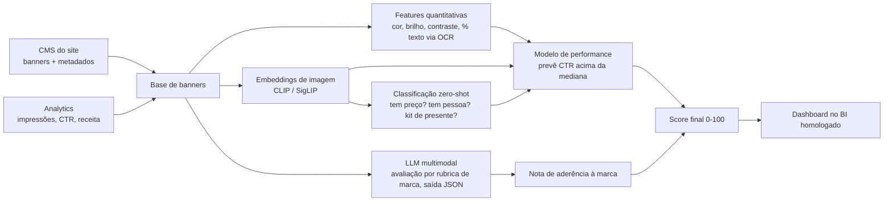

# 04 · Seção 2: pipeline de IA para classificar e pontuar banners

## Resposta em uma frase

Não usar a ferramenta não homologada, não matar a ideia: transformar o entusiasmo do time num **MVP de 6 semanas na stack já aprovada**, com o time do hackathon dono dos critérios de negócio e o time de dados dono do pipeline, e com critério de sucesso definido antes de começar.

---

## 1. Condução do problema junto ao time

| Passo | O que faço | Por quê |
|---|---|---|
| 1. Problema antes da ferramenta | Pergunto "que decisão vocês querem tomar com esse score?" (escolher o banner da home, revisar criativo antes de publicar, priorizar refação) | Sem decisão clara, nenhum score gera valor |
| 2. Explico a homologação em linguagem de negócio | Segurança, LGPD, risco de vazar campanha não lançada, contrato e custo sem controle | Governança protege a marca; não é burocracia |
| 3. Trago Segurança e Arquitetura cedo, como aliados | Pergunto qual a alternativa homologada mais próxima e, se fizer sentido, abro o pedido formal de homologação em paralelo | Evita retrabalho e mostra que a inovação tem caminho |
| 4. Divido por competência | Time do hackathon: rubrica de marca, critérios criativos, uso do resultado. Time de dados: pipeline e modelo | Ninguém precisa aprender Python; cada um faz o que sabe |
| 5. Combino MVP com prazo e critério de sucesso | 6 semanas, um tipo de banner, métrica definida no dia 1 | Se não funcionar, o aprendizado custou pouco |

Tradução do técnico para o negócio, com exemplos de frase:
- **Embedding:** "transformar cada imagem numa impressão digital numérica; banners parecidos ficam com impressões digitais parecidas".
- **Zero-shot:** "perguntar ao modelo se o banner tem preço em destaque, sem precisar ensinar com exemplos".
- **Score:** "uma nota de 0 a 100 que resume a chance de o banner performar bem e o quanto ele segue a marca".

---

## 2. Implementação técnica (sem impeditivos de ferramenta)

| Etapa | Técnica | Detalhe |
|---|---|---|
| Inventário | Export do CMS (melhor que scraping) | Posição, campanha, período no ar, canal |
| Rótulo de performance | Join com o analytics | CTR, conversão e receita atribuída por banner. É o que ensina o modelo o que é "bom" |
| Features quantitativas | Processamento de imagem clássico + OCR | Resolução, brilho, contraste, cores dominantes, área de texto, presença de produto/rosto |
| Features qualitativas | Embeddings CLIP/SigLIP + zero-shot | Vetor de cada banner e respostas a perguntas em texto, sem rotulagem manual |
| Aderência à marca | LLM multimodal com rubrica do time criativo | Nota de 1 a 5 por critério + justificativa, saída JSON |
| Score | Regressão logística ou LightGBM sobre embeddings + features | Controla posição e período (Black Friday infla CTR de qualquer banner) |
| Consumo | Dashboard no BI já usado | Onde o time no-code atua |

**Ressalva obrigatória:** score correlacionado com CTR não prova causa. Por isso o modelo controla posição e período, e o score só escala depois de validado em teste A/B.

---

## 3. Como justificar para a gestão sênior

### Estrutura da conversa (1 página)
Problema → proposta → MVP → custo vs retorno → riscos → decisão pedida.

### MVP de 6 semanas

| Item | Escopo |
|---|---|
| Recorte | Banners do carrossel da home, últimos 6 meses |
| Time | 1 pessoa de dados (meio período) + time do hackathon na rubrica |
| Stack | Nuvem, BI e APIs de modelo já homologados |
| Entrega | Score por banner num dashboard + rubrica de marca automatizada |
| Critério de sucesso | No conjunto de teste, banners do quartil superior de score têm CTR maior que os do quartil inferior; time criativo usa o score na revisão |

### Custo vs retorno

**Custo:** o maior custo é de pessoas (uma pessoa de dados por 6 semanas, meio período). Processar algumas centenas de imagens com embeddings e um LLM multimodal custa na ordem de dezenas a poucas centenas de reais em API; o valor exato depende do contrato vigente e deve ser confirmado antes da apresentação.

**Retorno:** fórmula com premissas visíveis, conectada à Seção 1:

`ganho mensal = sessões na home × aumento de CTR do banner × conversão de quem clica × ticket médio`

O ticket médio vem da Seção 1: **R$ 80 no App e R$ 88 no Site**. As demais premissas abaixo são **hipotéticas**, só para mostrar a ordem de grandeza; os números reais vêm do analytics.

| Cenário (hipotético) | Sessões/mês na home | +CTR (p.p.) | Conversão do clique | Ticket | Ganho mensal |
|---|---|---|---|---|---|
| Conservador | 5 mi | 0,1 | 3% | R$ 80 | R$ 12 mil |
| Base | 5 mi | 0,3 | 4% | R$ 80 | R$ 48 mil |
| Otimista | 5 mi | 0,5 | 5% | R$ 80 | R$ 100 mil |

**Retorno indireto:** menos retrabalho criativo e revisão mais rápida antes de publicar.

### Investimento em etapas, com saída barata

| Fase | Duração | Gate para seguir |
|---|---|---|
| MVP | 6 semanas | Score separa banners de CTR alto e baixo no teste |
| Piloto com teste A/B | 1 mês | Banners escolhidos pelo score têm CTR significativamente maior |
| Escala | Contínuo | Outras posições do site e o App |

### Riscos e mitigação

| Risco | Mitigação |
|---|---|
| Score aprende sazonalidade, não qualidade do banner | Controlar período e posição; validar com A/B |
| Rubrica subjetiva demais | Calibrar o LLM com 30 banners avaliados pelo time criativo |
| Dados de campanha não lançada | Processar só na stack homologada, sem envio a ferramentas externas |
| Time do hackathon perder o engajamento | Ele é dono da rubrica e do uso; demo a cada 2 semanas |
